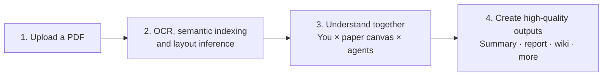

<p align="center">
  
</p>

<h1 align="center">ThinkReader</h1>

<p align="center">
  <a href="README_cn.md">简体中文</a> · <a href="https://github.com/zhangzejing/ThinkReader/releases">Downloads</a> · <a href="#get-started">Get started</a> · <a href="#common-commands">Commands</a> · <a href="https://zhangzejing.github.io/ThinkReader/">Interactive gallery</a> · <a href="#skills">Skills</a>
</p>

<p align="center"><strong>A reader that thinks. The free and intelligent app for smooth agentic reading and beyond.</strong></p>

This repository publishes the Windows app, the interactive gallery, and the Skills that ship with ThinkReader. The desktop app source is not included.

## What is ThinkReader?

ThinkReader is an agentic app for paper research. Your agents read alongside you and leave comments on the original PDF, so you can follow an idea back to its evidence without giving up control of what the paper really says. The knowledge you build together can support summaries, reports, mind maps, slides, and reproduction projects—all grounded in the source.

## Why ThinkReader?

One kind of agentic paper reading turns papers into fast-food summaries; another floods the page with untraceable AI-generated information.

ThinkReader is neither: it keeps the original PDF, your judgment, and the agent's work in one place. It lets you open the paper, read it quickly but deeply, and turn what you learn into high-quality outputs. Only making the paper your own understanding can truly move your research forward.

## How it works



**A paper odyssey**: you upload a paper to a Library; MinerU builds semantic and layout resources, while the original PDF always remains the reading surface. Then you, the paper canvas, and agents build understanding around the evidence together. That understanding can become a report, wiki, slides, mind map, or reproduction starting point—and always remains traceable to the paper.

## Features

- **Read in flow.** Agent annotations stream onto the PDF canvas without interrupting your reading.
- **Multi-agent collaboration.** Give agents distinct roles, work together in a Channel, and carry the conversation across reading and writing.
- **Intelligent layout.** Read in one to three columns and arrange the page around your needs; agents understand the original layout, making paper-grounded conversation effortless.
- **Read once, reuse everywhere.** Carry everything you understand while reading into summaries, reports, slides, mind maps, and reproduction projects.
- **Find what's next.** Compile knowledge across papers into a research network and find the next question worth exploring.

## Get started

### Download the app

ThinkReader 0.7.5 is available for Windows x64. The binaries are unsigned.

- [Windows installer](https://github.com/zhangzejing/ThinkReader/releases/download/v0.7.5/ThinkReader-Setup-0.7.5-win_x64.exe)
- [Portable Windows app](https://github.com/zhangzejing/ThinkReader/releases/download/v0.7.5/ThinkReader-0.7.5-win_x64.exe)
- [Release notes](https://github.com/zhangzejing/ThinkReader/releases/tag/v0.7.5)

### First use

No environment setup is required: open ThinkReader and the App guides you through everything.

1. Create a ThinkReader Library; the App creates its file structure automatically.
2. Put your paper PDF in that Library's `RAW/` folder, or import it from the Library home.
3. MinerU automatically processes imported papers. Local MinerU downloads models before its first extraction, so this step can take a while.
4. Open the paper and start with `@Agent /browse`, `/summary`, or `/annotation`.
5. Check the annotations against the source and cite a passage in your next question.

## Common commands

| Command | Purpose |
| --- | --- |
| `/browse` | Organize the paper's main thread into reading cards |
| `/annotation`, `/deep-annotation` | Annotate the paper at different depths |
| `/flash-annotation` | Lightweight key-phrase annotation |
| `/review`, `/deep-review` | Examine contributions, evidence, assumptions, and limitations |
| `/summary` | Create a concise summary for side-by-side reading |
| `/report` | Develop a longer research report |
| `/wiki` | Connect findings across papers |
| `/slides` | Prepare a research presentation |
| `/mindmap` | Organize ideas on a canvas |
| `/codebase` | Create a reproduction starter project |
| `/translate` | Translate a paper while keeping the original layout |
| `/health-check` | Check Library records and paper-index consistency |

Paper commands default to the current paper. Full-paper reading commands retain their whole-paper scope; a focus changes emphasis. Generated findings and code still need your review.

## Explore the gallery

[Attention Is All You Need](https://zhangzejing.github.io/ThinkReader/#attention) · [Explainable El Niño](https://zhangzejing.github.io/ThinkReader/#xro) · [Research atlases](https://zhangzejing.github.io/ThinkReader/#atlases)

Interactive demos show the way of desktop App running; agent execution in the online gallery is simulated.

## Skills

System Skills used by ThinkReader commands live in [`skills/`](skills/). Copy a Skill into the App's personal Skills folder to inspect or adapt it.

| Skill | Used by |
| --- | --- |
| `annotation-skill` | `/browse`, `/annotation`, `/flash-annotation`, `/deep-annotation` |
| `summary-skill` | `/summary`, `/review`, `/deep-review` |
| `report-skill` | `/report` |
| `wiki-skill` | `/wiki` |
| `slides-skill` | `/slides` |
| `mindmap-skill` | `/mindmap` |
| `codebase-skill` | `/codebase` |
| `translate-skill` | `/translate` |
| `app-control-skill` | `/health-check` |

## Keep your workspace

A Library is a folder you choose in the App. Its main areas are:

```text
Your Library/
├── RAW/                         Original imported PDFs
├── .thinkreader/                Library identity, paper records and annotation sidecars
├── workspace/<paper-id>/
│   ├── mineru/runs/             Immutable extraction runs
│   ├── intelligence/            Semantic indexes, source geometry and reusable figures
│   │   └── document.md          Editable reading copy
│   └── notes.md                 Independent paper notes, created when requested
├── output/                      summary/, report/, wiki/, codebase/, slides/, mindmap/, translate/
├── index.html                   Library home entry
└── agents.html                  Agents entry
```

Some folders and files appear only when the corresponding feature is used. Keep the whole Library when backing up: editable notes and research outputs are user data, including those alongside derived indexes.

Markdown notes have base editable features. Drag tabs to arrange up to three reading columns. Themes, accent colors, and editable Skills adapt the workspace to your practice.

App settings and Agent state are managed separately from individual Libraries. Back up both when moving devices. Local storage does not mean local-only processing: selected content may be sent to the Agent or extraction provider you configure.

[MIT License](LICENSE) applies to the Skills and gallery in this repository.
