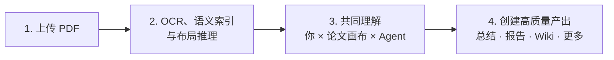

<p align="center">
  
</p>

<h1 align="center">ThinkReader</h1>

<p align="center">
  <a href="README.md">English</a> · <a href="https://github.com/zhangzejing/ThinkReader/releases">下载</a> · <a href="#快速开始">开始使用</a> · <a href="#常用命令">命令</a> · <a href="https://zhangzejing.github.io/ThinkReader/">交互式画廊</a> · <a href="#skills">Skills</a>
</p>

<p align="center"><strong>会思考的阅读器：免费、智能、流畅的 Agent 论文阅读体验。</strong></p>

本仓库发布 Windows 安装包、交互式画廊，以及随 ThinkReader 提供的 Skills。桌面应用源码不包含在此仓库中。

## ThinkReader 是什么？

ThinkReader 是面向论文研究的 Agent App。Agent 会和你一起阅读原始 PDF，并把解释、疑问与证据留在对应位置；你始终可以回到原文，判断论文真正说了什么。阅读中积累的知识还能继续用于总结、报告、思维导图、幻灯片和复现项目，并始终以原文为依据。

## 为什么是 ThinkReader？

一种 Agentic 论文阅读把论文压缩成快餐式总结，另一种则让无法追溯的 AI 信息淹没页面。ThinkReader 不属于任何一端：原始 PDF、你的判断和 Agent 的工作都在同一个地方。它让你真正打开论文，快速但深入地读进去，并把所学沉淀为高质量产出。只有把论文真正变成自己的理解，研究才能向前推进。

## 工作原理



**一篇论文的旅程**：你把论文上传到 Library；MinerU 建立语义与布局资源，原始 PDF 始终是阅读界面。随后，你、论文画布和 Agent 围绕证据共同理解论文。理解可以沉淀为报告、Wiki、幻灯片、思维导图或复现起点，并始终能够回到原文核验。

## 功能

- **沉浸式阅读。** Agent 批注通过流式渲染到PDF画布，不会打断你的阅读。
- **多 Agent 协作。** 为 Agent 分配角色，在频道中协作，并让对话延续到阅读与写作。
- **智能布局。** 支持1到3栏阅读，根据需要定制你的页面；Agent对原文布局了如指掌，对话交互轻而易举。
- **一次阅读，处处复用。** 将所有阅读中的理解用于总结、报告、幻灯片、思维导图和复现项目。
- **发现下一步。** 多篇论文的知识编译成知识网络，找到下一条值得探索的问题。

## 快速开始

### 下载 App

ThinkReader 0.7.5 提供 Windows x64 版本，当前二进制文件未签名。

- [Windows 安装版](https://github.com/zhangzejing/ThinkReader/releases/download/v0.7.5/ThinkReader-Setup-0.7.5-win_x64.exe)
- [Windows 便携版](https://github.com/zhangzejing/ThinkReader/releases/download/v0.7.5/ThinkReader-0.7.5-win_x64.exe)
- [发布说明](https://github.com/zhangzejing/ThinkReader/releases/tag/v0.7.5)

### 第一次使用

无需任何环境配置：打开 ThinkReader，App 会引导你设置好一切。

1. 新建一个 ThinkReader 论文库，App 会自动创建其中的文件目录。
2. 将论文 PDF 放入刚才论文库下的 `RAW/` 文件夹，或从App库主页导入。
3. MinerU 会自动解析导入内容；本地 MinerU 首次解析需要下载模型，因此耗时较长。
4. 打开论文，输入 `@Agent /browse`、`/summary` 或 `/annotation`。
5. 回到原文核对批注，并把一段原文作为引用加入下一轮提问。

## 常用命令

| 命令 | 用途 |
| --- | --- |
| `/browse` | 将论文主线组织为阅读卡片 |
| `/annotation`、`/deep-annotation` | 以不同深度批注论文 |
| `/flash-annotation` | 轻量关键短语批注 |
| `/review`、`/deep-review` | 审视贡献、证据、假设与局限 |
| `/summary` | 生成适合并排阅读的精炼总结 |
| `/report` | 整理较完整的研究报告 |
| `/wiki` | 连接多篇论文的发现 |
| `/slides` | 准备研究演示文稿 |
| `/mindmap` | 在画布上组织概念与联系 |
| `/codebase` | 建立研究复现的起始项目 |
| `/translate` | 在保留原布局的前提下翻译论文 |
| `/health-check` | 检查论文库记录与论文索引一致性 |

论文命令默认处理当前论文。全文阅读命令保持全文范围，关注点用于调整侧重。生成的结论与代码仍需研究者核验。

## 浏览画廊

[Attention Is All You Need](https://zhangzejing.github.io/ThinkReader/#attention) · [Explainable El Niño](https://zhangzejing.github.io/ThinkReader/#xro) · [研究知识网络](https://zhangzejing.github.io/ThinkReader/#atlases)

截图展示的是正在运行的桌面 App；在线画廊中的 Agent 执行过程为模拟效果。

## Skills

ThinkReader 命令使用的系统 Skills 在 [`skills/`](skills/) 中。可复制到 App 的个人 Skills 目录中查看或修改。

| Skill | 对应命令 |
| --- | --- |
| `annotation-skill` | `/browse`、`/annotation`、`/flash-annotation`、`/deep-annotation` |
| `summary-skill` | `/summary`、`/review`、`/deep-review` |
| `report-skill` | `/report` |
| `wiki-skill` | `/wiki` |
| `slides-skill` | `/slides` |
| `mindmap-skill` | `/mindmap` |
| `codebase-skill` | `/codebase` |
| `translate-skill` | `/translate` |
| `app-control-skill` | `/health-check` |

## 保留自己的工作区

Library 是你在 App 中选择的论文库文件夹。主要目录如下：

```text
your Library/
├── RAW/                         导入的原始 PDF
├── .thinkreader/                库身份、论文记录与独立批注文件
├── workspace/<paper-id>/
│   ├── mineru/runs/             不可变的解析运行记录
│   ├── intelligence/            语义索引、原文坐标与可复用图像
│   │   └── document.md          可编辑的阅读副本
│   └── notes.md                 按需创建的独立论文笔记
├── output/                      summary/、report/、wiki/、codebase/、slides/、mindmap/、translate/
├── index.html                   Library 主页入口
└── agents.html                  Agents 入口
```

部分目录和文件会在使用对应功能时创建。备份时保留整个 Library：笔记和研究输出属于用户数据，与派生索引放在一起的可编辑文件也不能当作缓存删除。

Markdown 笔记具有基础的编辑功能；拖动标签即可安排最多三栏阅读。主题、强调色和可编辑的 Skills 用来适配自己的研究习惯。

App 设置与 Agent 状态独立于具体论文库管理，迁移设备时应同时备份。本地存储不等于全部本地计算：所选内容可能发送至你配置的 Agent 或解析服务。

本仓库中的 Skills 与画廊使用 [MIT License](LICENSE)。
